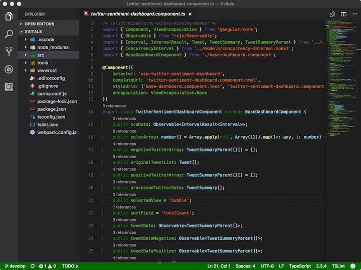
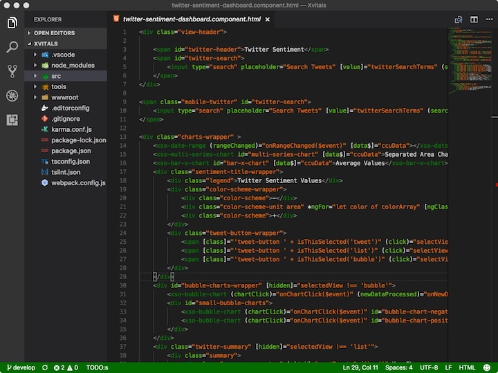
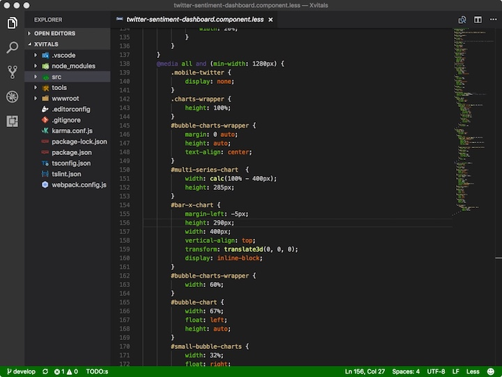
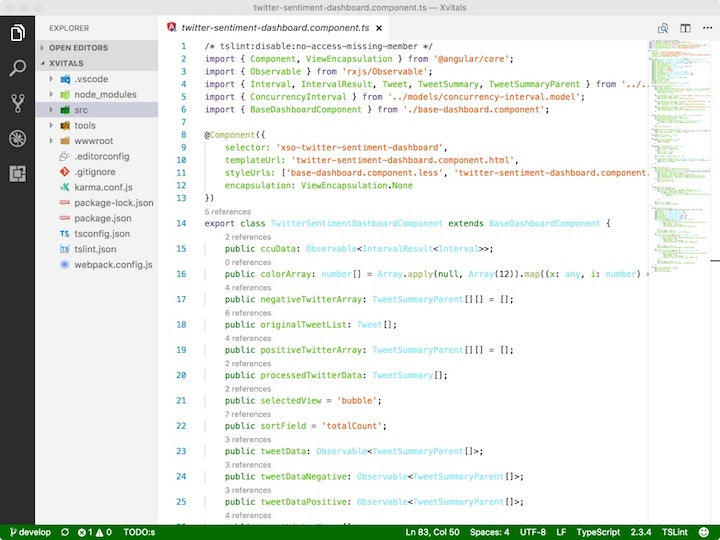
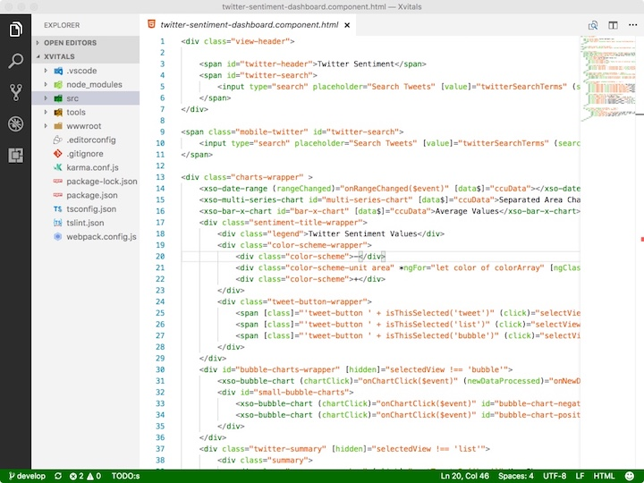
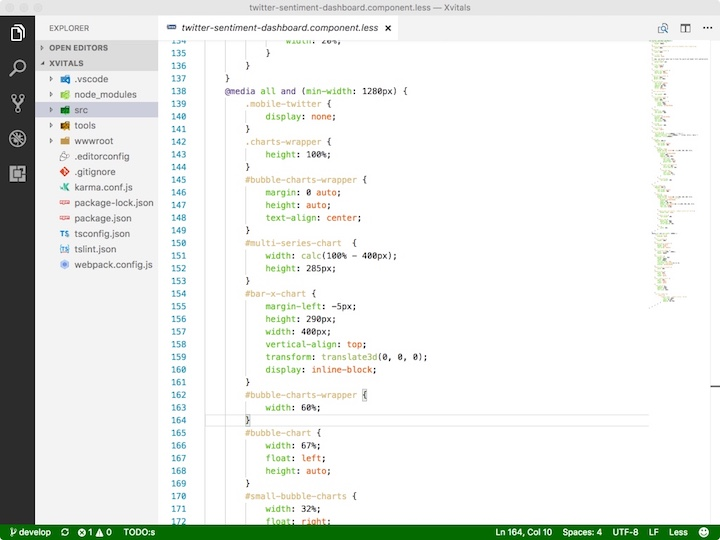

# Xbox Theme for VS Code

[](https://marketplace.visualstudio.com/items?itemName=hector-jimenez.xbox-theme)
[](https://marketplace.visualstudio.com/items?itemName=hector-jimenez.xbox-theme)
[](https://marketplace.visualstudio.com/items?itemName=hector-jimenez.xbox-theme&ssr=false#review-details)
[](LICENSE)

Two Visual Studio Code color themes inspired by the official Xbox palette:

- **Xbox Dark** — the classic deep-charcoal Xbox dashboard look
- **Xbox Light** — a clean light variant with Xbox green accents

---

## Install

From inside VS Code:

1. Open the Extensions view (`Ctrl+Shift+X` / `Cmd+Shift+X`).
2. Search for **Xbox Theme**.
3. Click **Install**.
4. Open the Command Palette (`Ctrl+Shift+P` / `Cmd+Shift+P`) → **Preferences: Color Theme** → pick **Xbox Dark** or **Xbox Light**.

Or from the command line:

```sh
code --install-extension hector-jimenez.xbox-theme
```

---

## Screenshots

### Xbox Dark

| TypeScript | HTML | LESS |
|---|---|---|
|  |  |  |

### Xbox Light

| TypeScript | HTML | LESS |
|---|---|---|
|  |  |  |

---

## Recommended settings

For the best experience, enable VS Code's modern UI features that this theme is tuned for:

```jsonc
{
  "editor.bracketPairColorization.enabled": true,
  "editor.guides.bracketPairs": "active",
  "editor.stickyScroll.enabled": true,
  "editor.inlayHints.enabled": "onUnlessPressed",
  "editor.semanticHighlighting.enabled": true,
  "workbench.editor.showTabs": "multiple",
  "workbench.tree.indent": 16
}
```

---

## Palette

The themes use the official Xbox palette (mostly):

| Swatch | Hex | Name |
|---|---|---|
| 🟩 | `#107c10` | Xbox green |
| 🟢 | `#9bf00b` | Light green |
| ⬛ | `#171717` | Black |
| ⬜ | `#f1f1f1` | White |
| 🩵 | `#83e7fb` | Light blue |
| 🟦 | `#2972d1` | Blue |
| 🟧 | `#e3641a` | Orange |
| 🟨 | `#ffd800` | Yellow |

See [`themes/palette.css`](themes/palette.css) for the full swatch.

---

## Contributing

Issues and pull requests are welcome at [github.com/hectorjjb/vs-code-xbox-theme](https://github.com/hectorjjb/vs-code-xbox-theme).

If you find a UI element that isn't colored well (or at all), please open an issue with a screenshot and the VS Code version.

---

## License

[Apache-2.0](LICENSE) © Hector Jimenez
