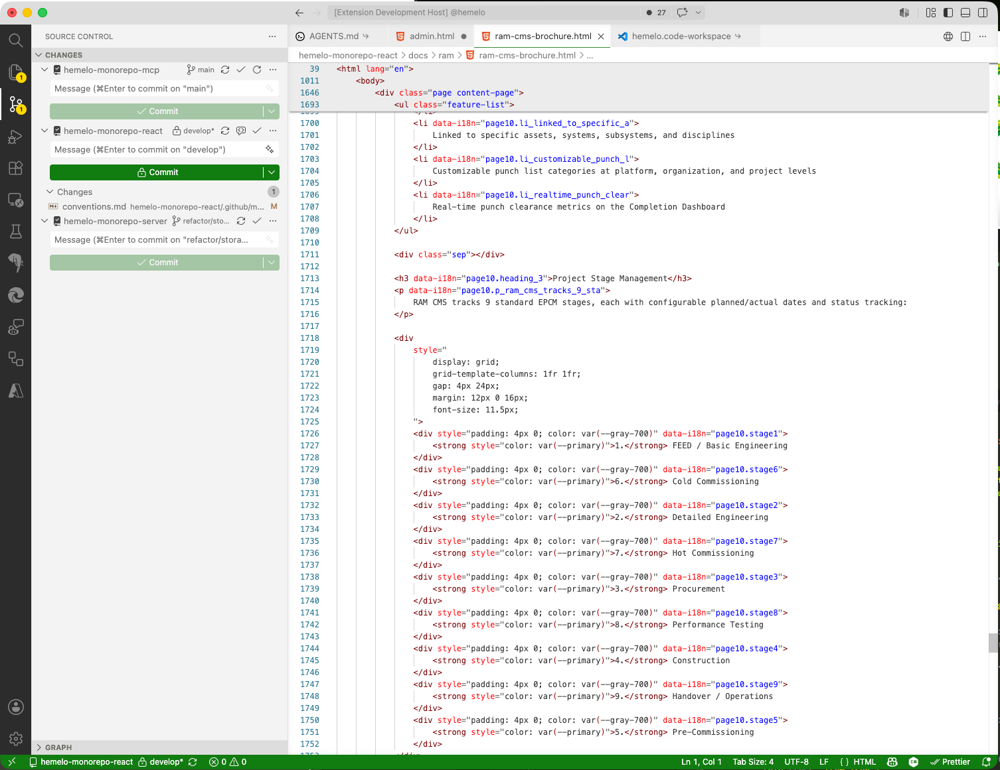
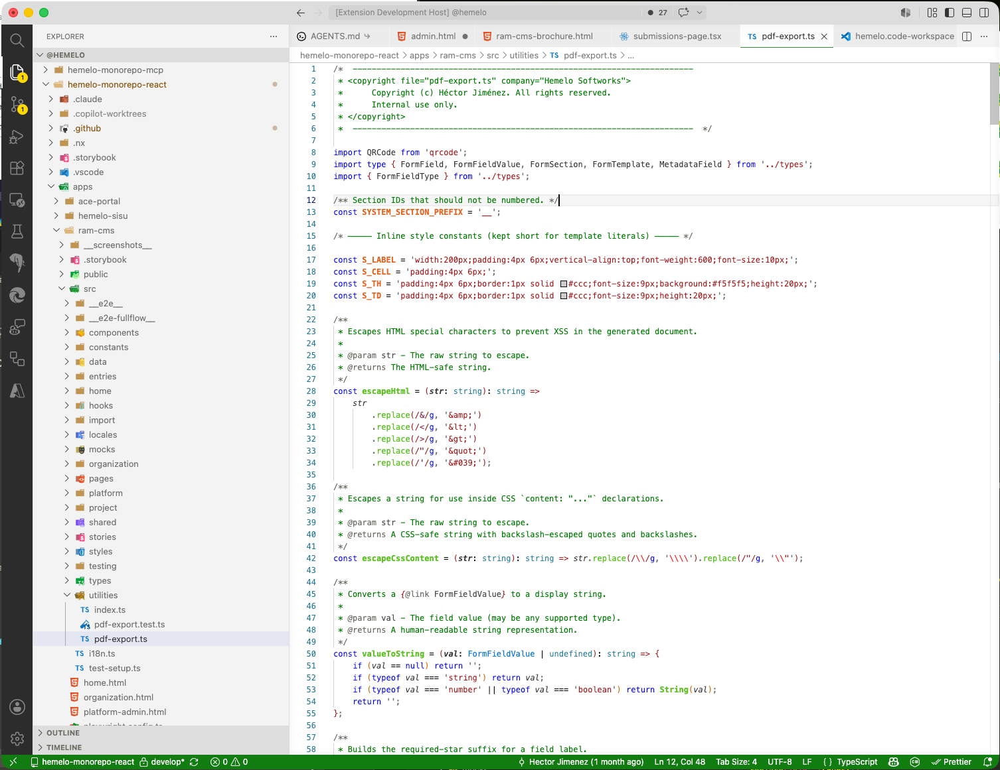
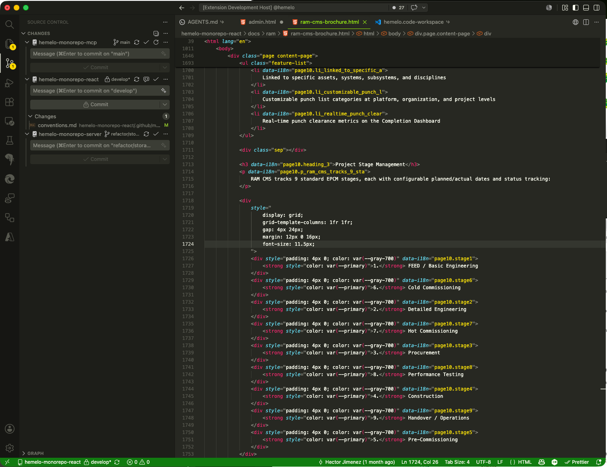
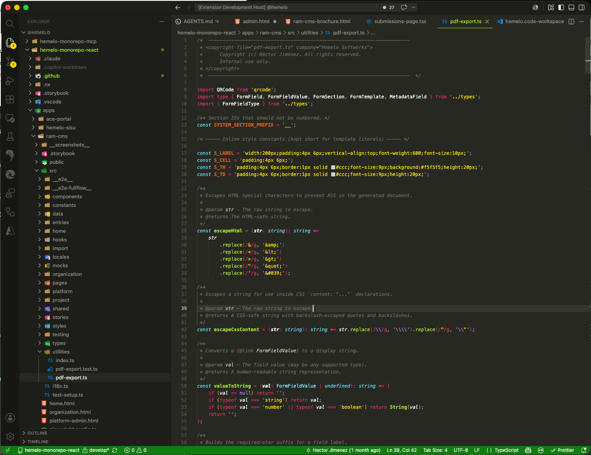
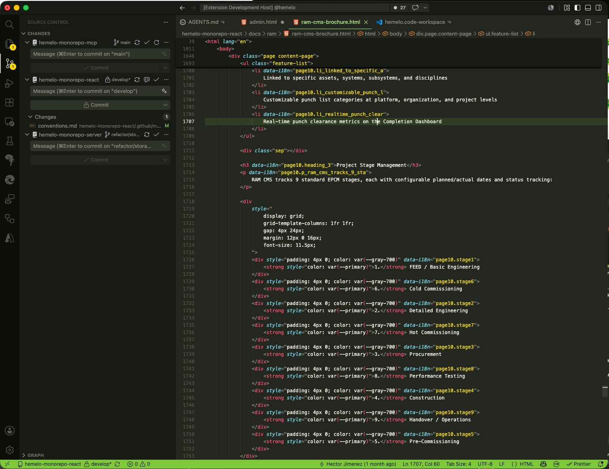
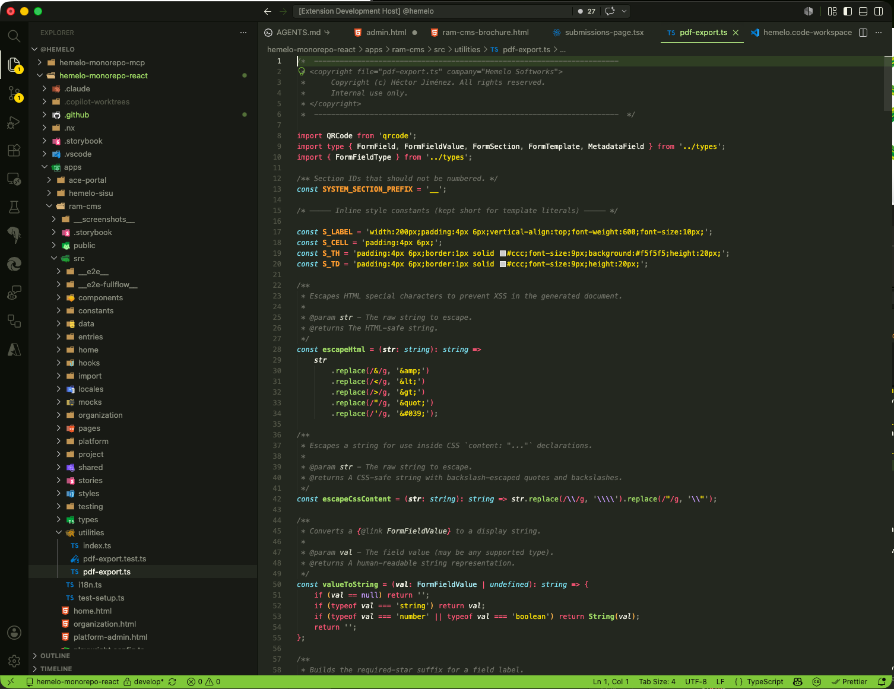

# Xbox Theme for VS Code

[](https://marketplace.visualstudio.com/items?itemName=hector-jimenez.xbox-theme)
[](https://marketplace.visualstudio.com/items?itemName=hector-jimenez.xbox-theme)
[](https://marketplace.visualstudio.com/items?itemName=hector-jimenez.xbox-theme&ssr=false#review-details)
[](LICENSE)

Visual Studio Code color themes inspired by the Xbox console generations:


- **XBOX 360** — clean light variant with Xbox green accents (2005)
- **XBOX ONE** — the classic deep-charcoal dashboard look (2013)
- **XBOX Series X** — 25th Anniversary edition inspired by the translucent OG Xbox green hardware — neutral warm grays with a soft controller-lime accent

> A fourth theme for the **original XBOX** (2001) is planned to complete the console generations set.

---

## Install

From inside VS Code:

1. Open the Extensions view (`Ctrl+Shift+X` / `Cmd+Shift+X`).
2. Search for **Xbox Theme**.
3. Click **Install**.
4. Open the Command Palette (`Ctrl+Shift+P` / `Cmd+Shift+P`) → **Preferences: Color Theme** → pick **XBOX 360**, **XBOX ONE**, or **XBOX Series X**.

Or from the command line:

```sh
code --install-extension hector-jimenez.xbox-theme
```

---

## Screenshots

Same HTML and TypeScript files rendered in each theme, in console-generation order:

### XBOX 360

| HTML | TypeScript |
| --- | --- |
|  |  |

### XBOX ONE

| HTML | TypeScript |
| --- | --- |
|  |  |

### XBOX Series X

| HTML | TypeScript |
| --- | --- |
|  |  |

---

## Contributing

Issues and pull requests are welcome at [github.com/hectorjjb/vs-code-xbox-theme](https://github.com/hectorjjb/vs-code-xbox-theme).

If you find a UI element that isn't colored well (or at all), please open an issue with a screenshot and the VS Code version.

---

## License

[Apache-2.0](LICENSE) © Hector Jimenez
